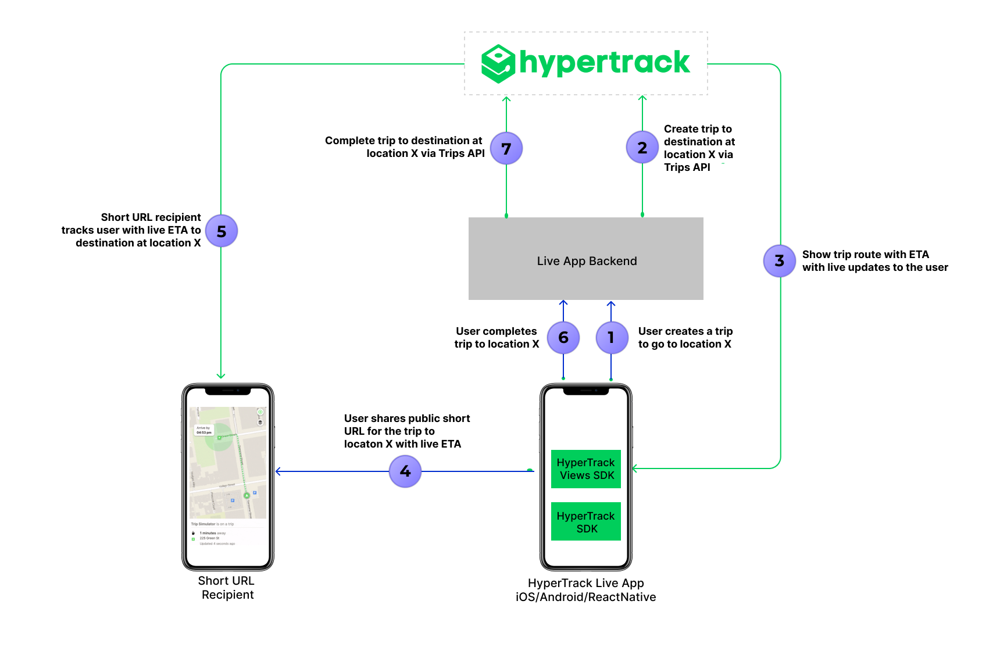

# Live Location Sharing
[](https://opensource.org/licenses/MIT) [](https://opensource.org/licenses/MIT) 

This open source app for Live Location Sharing is built with [HyperTrack](https://www.hypertrack.com). Developers can now build live location sharing into their apps within minutes by using HyperTrack Live source code. For iOS, refer to our open source [iOS repository](https://github.com/hypertrack/live-app-ios).

[HyperTrack Live for Android](https://play.google.com/store/apps/details?id=com.hypertrack.live) is available on the Google Play Store for use by users signed up with HyperTrack. [HyperTrack Live for iOS](https://apps.apple.com/us/app/hypertrack-live/id1076924821) is available on the public App Store.

> 👋 Read our [blog post announcement](https://hypertrack.com/blog/2019/07/19/build-live-location-sharing-in-your-work-app-within-minutes/) to learn more about this sample app.

The app demonstrates a simple flow for users to share their live location with friends through their favorite messaging app when on the way to meet up. The convenient 23-character secure short-URL displays live location with accuracy, speed, bearing and recency. The view highlights the ongoing activity (walk, drive, stop, etc.). Device getting inactive due to permissions or other reasons, or disconnected due to unknown reasons is highlighted in the tracking experience. Battery charing and low battery states are flagged as well.

## Live Location Sharing
The primary feature of Hypertrack Live is Live Location Sharing. Live Location Sharing is useful for:
- Workforce productivity apps with messaging and customer support capabilities
- Peer-to-peer marketplaces for goods and services
- Ridesharing and carpooling apps
- Consumer apps like messengers and social apps

It helps solve the user's anxiety of “where are you⁉️”.

## Architecture



<details>
    <summary>Step by step process of communication:</summary>
            
1. **User makes a request to go to destination at  location X**
   - Prior to creating a trip to go to destination X, the user signs in into HyperTrack Live App using a HyperTrack account. HyperTrack Live App authenticates the user to Live App Backend and obtains a JWT auth token to access it. Live App Backend serves as a backend platform example for HyperTrack Live App to demonstrate the following:
     - Performs as HyperTrack Live App user management service. For this example, we use HyperTrack dashboard account user management as the way to perform HyperTrack Live App user management. You may wish to use your own user management setup for the app you are building.
     - Performs as HypeTrack Live App backend server performing HyperTrack APIs calls which require authentication via AccountId and SecretKey available in the [setup page](https://dashboard.hypertrack.com/setup).
   - Once the user picks a location in the app and creates a trip with a destination to it, HyperTrack Live App performs a call to Live App Backend with the JWT token from the above.  
2. **Create trip to destination at location X via Trips API**
   - Live App Backend uses [HyperTrack Trips API](https://docs.hypertrack.com/#guides-track-trips-with-destination) to create a trip with destination X. In order to authenticate to use the API, Live App Backend uses AccountId and SecretKey.
3. **Show trip route with ETA with live updates to the user**
   - HyperTrack Views SDK queries the new trip information and provides trip information to HyperTrack Live App user. In addition, HyperTrack Views SDK receives realtime updates from HyperTrack platform and provides them as callbacks to HyperTrack Live App.
4. **User shares public short URL for the trip to locaton X with live ETA**
   - HyperTrack Live App user can share a publicly visible trip URL for the trip with anyone on the internet with a browser. 
5. **Short URL recipient tracks user with live ETA to destination at location X**
   - The recipient or multiple recipients of the publicly visible trip URL can view HyperTrack Live App user ETA and location in realtime.
6. **User ends live location sharing**
   - HyperTrack Live App user may end the trip upon reaching the destination. HyperTrack Live App notifies Live App Backend while authenticating with the JWT token from above. 
7. **Complete trip to destination at location X via Trips API**
   - Live App Backend uses [HyperTrack Trips API](https://docs.hypertrack.com/#guides-track-trips-with-destination-start-and-complete-trips) to complete the trip with destination X.
   - HyperTrack Trips API updates HyperTrack Views SDK in HyperTrack Live App with a completed trip summary to be displayed to the user. Additionally, recipients of publicly visible trip URL receive a live update about the trip completion and are displayed a completed trip summary as well.
   
</details>

## How HyperTrack Live App uses HyperTrack Trips API

HyperTrack Live App uses [HyperTrack Trips API](https://docs.hypertrack.com/#guides-track-trips-with-destination) to [create](https://docs.hypertrack.com/#references-apis-trips-post-trips) and [complete](https://docs.hypertrack.com/#references-apis-trips-post-trips-trip_id-complete) trips by using Live App Backend. Live App Backend allows to integrate with [HyperTrack Trips API](https://docs.hypertrack.com/#guides-track-trips-with-destination) via backend server integration.

Once the trip is created in the HyperTrack Live App, the Live App calls Live App Backend which in turn creates a trip via [Trips API](https://docs.hypertrack.com/#guides-track-trips-with-destination). Once the trip is completed, the app notifies Live App Backend, which in turn calls HyperTrack Trips API to [complete](https://docs.hypertrack.com/#references-apis-trips-post-trips-trip_id-complete) the trip.

## Usage
#### To use this app

```bash
# Clone this repository
$ git clone https://github.com/hypertrack/live-app-android.git

# Go into the repository
$ cd live-app-android

# Change com.google.android.geo.API_KEY on yours in AndroidManifest.xml
<meta-data
            android:name="com.google.android.geo.API_KEY"
            android:value="<you_google_maps_key>" />
```

Get your HyperTrack Publishable Key [here](https://dashboard.hypertrack.com/signup) and type it in the Publishable Key screen in the app.

## Documentation
For detailed documentation of the APIs, customizations and what all you can build using HyperTrack, please visit the official [docs](https://docs.hypertrack.com/).

- [HyperTrack Quickstart](https://github.com/hypertrack/quickstart-android)
- [HyperTrack Views Sample](https://github.com/hypertrack/views-android)
- [HyperTrack Maps SDK](https://github.com/hypertrack/sdk-maps-google-android)

## Contribute
Feel free to clone, use, and contribute back via [pull requests](https://help.github.com/articles/about-pull-requests/). We'd love to see your pull requests - send them in! Please use the [issues tracker](https://github.com/hypertrack/live-app-android/issues) to raise bug reports and feature requests.

We are excited to see what Live Location feature you build in your app using this project. Do ping us at help@hypertrack.com once you build one, and we would love to feature your app on our blog!

## Support
Join our [Slack community](https://join.slack.com/t/hypertracksupport/shared_invite/enQtNDA0MDYxMzY1MDMxLTdmNDQ1ZDA1MTQxOTU2NTgwZTNiMzUyZDk0OThlMmJkNmE0ZGI2NGY2ZGRhYjY0Yzc0NTJlZWY2ZmE5ZTA2NjI) for instant responses. You can also email us at help@hypertrack.com.


