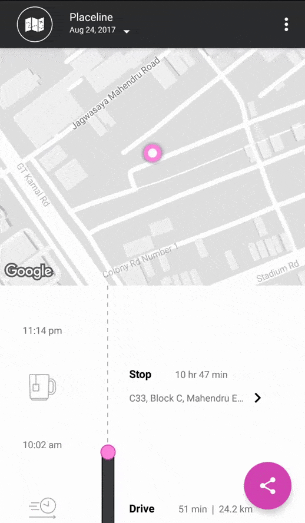

# Activity Tracking and Live Location Sharing
[](https://travis-ci.org/hypertrack/hypertrack-live-android) [](https://www.codacy.com/app/piyushguptaece/hypertrack-live-android?utm_source=github.com&utm_medium=referral&utm_content=hypertrack/hypertrack-live-android&utm_campaign=badger) [](http://slack.hypertrack.com) [](https://android-arsenal.com/details/3/5754) [](https://opensource.org/licenses/MIT) [](https://opensource.org/licenses/MIT)

This open source repo uses HyperTrack for Live Location Sharing and Activity Tracking. Hypertrack Live helps you share your Live Location with friends through your favorite messaging app when on the way to meet up. You can also see your activities organized as chronological cards so that tapping on each card gives you the locations of the activity.

| Usecase       |  Description  |  Tutorial     |
| ------------- | ------------- | ------------- |
| Activity Tracking  | Track your activities chronologicaly through the day. [Description](#activity-tracking) | [Build yourself 👩‍💻](#build-activity-tracking-in-your-app) |
| Live Location Sharing  | Share your Live Location with friends and see theirs. [Description](#live-location-sharing) | [Build yourself 👩‍💻](#build-live-location-sharing-in-your-app)|

- [Activity Tracking](#activity-tracking)
- [Live Location Sharing](#live-location-sharing)
- [Usage](#usage)
- [Build Activity Tracking in your app](#build-activity-tracking-in-your-app)
- [Build Live Location Sharing in your app](#build-live-location-sharing-in-your-app)
- [Documentation](#documentation)
- [Contribute](#contribute)
- [Support](#support)

## Activity Tracking
One of the two core features of Hypertrack Live is Placeline. Placeline is useful in tracking your daily activity with near-zero battery impact. We automagically use the combination of device sensors - GPS, WiFi, network, accelerometer, pedometer, gyroscope, compass - to deliver accuracy. Placeline is powered by the HyperTrack SDK which collects location and activity data for your users. It includes segments like stop 🛑, walk 🚶‍♀️,run 🏃‍♀️,drive 🏎️ and cycling 🚴. 

<p align="center">
<kbd>

</kbd>
</p>

## Live Location Sharing
The other core feature of Hypertrack Live is Live Location Sharing. Live Location Sharing is useful for consumer apps like messengers and social apps where two or more people want to share their Live Location with each other when on the way to meet up. It is also useful for marketplace aggregators where the transaction starts online 💻📱 but requires people to meet offline for fulfillment. It helps you solve the consumer's anxiety of “where are you⁉️”.

<p align="center">
<kbd>

</kbd>
</p>

## Usage
#### To use this app

1. Clone this repository
```bash
# Clone this repository
$ git clone https://github.com/hypertrack/hypertrack-live-android.git
```

2. Get your HyperTrack API keys [here](https://dashboard.hypertrack.com/signup), and add the publishable key to [key.properties](https://github.com/hypertrack/hypertrack-live-android/blob/master/key.properties) file.
```java
HyperTrack.initialize(this.getApplicationContext(), BuildConfig.HYPERTRACK_PK);
```

3. Get the [Google Maps API key](https://developers.google.com/maps/documentation/android-api/signup) and add it to [api-keys.xml](https://github.com/hypertrack/hypertrack-live-android/blob/master/app/src/main/res/values/api-keys.xml).

#### To build Placeline in your app, follow this [tutorial](#build-activity-tracking-in-your-app).
#### To build Live Location Sharing in your app, follow this [tutorial](#build-live-location-sharing-in-your-app).

## Build Activity Tracking in your app 
 - [Placeline format](#placeline-format)
 - [Setup HyperTrack SDK](#setup-hypertrack-sdk)
 - [Create Hypertrack user](#create-hypertrack-user)
 - [Start tracking](#start-tracking)
 - [Get Placeline in your app](#get-placeline-data-in-your-app)

#### Placeline format
Placeline object contains detailed information about the activity like the start time, end time, location, steps and more.
An example JSON representation is given [here](https://docs.hypertrack.com/gettingstarted/activities.html#placeline).

#### Setup HyperTrack SDK
Set up the HyperTrack SDK by following these [instructions](https://docs.hypertrack.com/sdks/android/setup.html).

#### Create HyperTrack user
The next thing that you need to do is create a HyperTrack User. This would tag the location/activity data to the user and help you get useful filtered data in the form of Placeline. More details about the function [here](https://docs.hypertrack.com/sdks/android/basic.html#step-1-create-sdk-user). 

```java
UserParams userParams = new UserParams()
                .setName(name)
                .setPhone(phoneNumber)
                .setPhoto(encodedImage)
                .setLookupId(phoneNumber);
                
HyperTrack.getOrCreateUser(userParams, new HyperTrackCallback() {
                @Override
                public void onSuccess(@NonNull SuccessResponse successResponse) {
                    // Handle success on getOrCreate user
                    HyperTrack.startTracking();
                }

                @Override
                public void onError(@NonNull ErrorResponse errorResponse) {
                    // Handle error on getOrCreate user
                    Toast.makeText(this, errorResponse.getErrorMessage(), Toast.LENGTH_SHORT).show();
                }
            });
```

#### Start tracking
Start tracking for the created user by calling the following method
```java
HyperTrack.startTracking();
```

#### Get Placeline Data in your app
Once tracking has started, implement the following function [placelineManager.getPlacelineData()](https://github.com/hypertrack/hypertrack-live-android/blob/master/app/src/main/java/io/hypertrack/sendeta/store/PlacelineManager.java#L43) and get [PlacelineData](https://github.com/hypertrack/hypertrack-live-android/blob/master/app/src/main/java/io/hypertrack/sendeta/model/PlacelineData.java). You are all set to use the rich activity data in your app.

```java
Date date = new Date();
HyperTrack.getPlaceline(date, new HyperTrackCallback() {
    @Override
    public void onSuccess(@NonNull SuccessResponse response) {
        // Handle getPlaceline success here
        if (response != null) {
            PlacelineData = (PlacelineData) response.getResponseObject();
        }
    }

    @Override
    public void onError(@NonNull ErrorResponse errorResponse) {
        // Handle getPlaceline error here
        Log.d("Placeline", "onError: " + errorResponse.getErrorMessage());
    }
});
```

#### Get Placeline View in your Android App

#### Step 1: Setup Activity

* **Firstly**, add the following xml snippet in your view layout to enable `PlacelineFragment`.

```xml
<fragment
    android:id="@+id/placeline_fragment"
    android:name="com.hypertrack.lib.internal.consumer.view.Placeline.PlacelineFragment"
    android:layout_width="match_parent"
    android:layout_height="match_parent"
    tools:layout="@layout/placeline_fragment" />
```

* **Secondly**, instantiate `PlacelineFragment` in the onCreate method of the activity in which placeline fragment has been included.

```java
PlacelineFragment placelineFragment = (PlacelineFragment) getSupportFragmentManager().findFragmentById(R.id.placeline_fragment);
```

Once all of the above is done, the code snippet would look like as below.

```java
@Override
protected void onCreate(Bundle savedInstanceState) {
  super.onCreate(savedInstanceState);

  ...

  // Initialize Placeline Fragment added in Activity Layout
  PlacelineFragment placelineFragment = (PlacelineFragment) getSupportFragmentManager().findFragmentById(R.id.placeline_fragment); 

  ...
}
```

#### Step 2: Disable ActionBar

In case your AppTheme adds an ActionBar by default, disable the default Action Bar for the activity containing PlacelineFragment by adding the following under your Activity's theme style-tag in styles.xml file. Refer to Android documentation on [Setting up the AppBar](https://developer.android.com/training/appbar/setting-up.html).

```xml
<!-- Change Placeline activity's theme to remove default ActionBar. -->
<style name="PlacelineActivityTheme" parent="Theme.AppCompat.Light.NoActionBar">
    ...
    <!-- We will be using the toolbar so no need to show ActionBar -->
    <item name="windowActionBar">false</item>
    <item name="windowNoTitle">true</item>
    <item name="colorAccent">@color/colorAccent</item>
	  ...
</style>
```

Add the `android:theme` attribute to the `<activity>` tag in `AndroidManifest.xml` file.

```xml
<!-- Placeline Activity Tag -->
 <activity android:name=".PlacelineActivity"
    android:theme="@style/PlacelineActivityTheme"/>
```


#### Step 3: Start Placeline Activity

Placeline Activity can be the `Launcher activity` or it can start from some other activity as normal activity.

**Launcher Activity**

Add the following xml snippet in your `AndroidManifest.xml` file to make `PlacelineActivity` as a launcher activity.


```xml
<activity
    android:name=".PlacelineActivity"
    android:theme="@style/PlacelineActivityTheme">
    <intent-filter>
        <action android:name="android.intent.action.MAIN" />
        <category android:name="android.intent.category.LAUNCHER" />
    </intent-filter>
</activity>
```

**Normal Activity**

Add the following snippet in your activity from which you want to start `PlacelineActivity`.


```java
public void startPlaceline(View view) {
    startActivity(new Intent(this, PlacelineActivity.class));
}
```


We hope that you got a good taste of Placeline. If you have any problems or suggestions for the tutorial, do not hesitate to buzz 🐝 us [here](#support).

## Build Live Location Sharing in your app 

Use the following tutorial to build  [Live Location Sharing](#live-location-sharing) in your app. This is divided into three section.
1. In the first section, we will do a basic setup of Hypertrack SDK. 
2. In the second section, we will select a destination and start a Live Location trip to that place. 
3. In the last section, we will get your friend to join the trip started by you. 

Let's get started 😊 . Strap yourself in and get ready for an exciting ride 🚀 .

- [Basic setup](#basic-setup)
  - [Get API keys](#step-1-get-api-keys)
  - [Use this project](#step-2-use-this-project)
  - [Setup HyperTrack SDK](#step-3-setup-hypertrack-sdk)
  - [Create HyperTrack user](#step-4-create-hypertrack-user)
  - [FCM Integration](#step-5-fcm-integration)
  - [Crashlytics Setup (optional)](#step-6-crashlytics-setup-optional)
- [Start a Live Location trip](#start-a-live-location-trip)
  - [Show Live Location view](#step-1-show-live-location-view)
  - [Create and track action](#step-2-create-and-track-action)
  - [Share your trip](#step-3-share-your-trip)
- [Track or join an ongoing trip](#track-or-join-an-ongoing-trip)
  - [Track ongoing trip](#step-1-track-ongoing-trip)
  - [Join ongoing trip](#step-2-join-ongoing-trip)

  
### Basic Setup
#### Step 1. Get API keys
Get your HyperTrack API keys [here](https://dashboard.hypertrack.com/signup).

#### Step 2. Use this project
We have created this project so that building Live Location Sharing becomes very easy and quick. It will prevent you from the hassle of creating a new project and the workflow to enable Live Location Sharing. If you want to directly build the flow in your own app or wanted to create a new project, you can ignore this step.

1. Clone this repository
```bash
# Clone this repository
$ git clone https://github.com/hypertrack/hypertrack-live-android.git
```

2. Get your HyperTrack API keys [here](https://dashboard.hypertrack.com/signup), and add the publishable key to [key.properties](https://github.com/hypertrack/hypertrack-live-android/blob/master/key.properties) file.
```java
HyperTrack.initialize(this.getApplicationContext(), BuildConfig.HYPERTRACK_PK);
```

3. Get the [Google Maps API key](https://developers.google.com/maps/documentation/android-api/signup) and add it to [api-keys.xml](https://github.com/hypertrack/hypertrack-live-android/blob/master/app/src/main/res/values/api-keys.xml).

#### Step 3. Setup HyperTrack SDK
If you are NOT using the starter project, set up the HyperTrack SDK by following these [instructions](https://docs.hypertrack.com/sdks/android/setup.html). Else, initialize the SDK by putting the following code in [MyApplication.java](https://github.com/hypertrack/hypertrack-live-android/blob/master/app/src/main/java/io/hypertrack/sendeta/MyApplication.java) file.

```java
public class MyApplication extends Application {

    @Override
    public void onCreate() {
        super.onCreate();
        
        ...
        
        // Initialize HyperTrack SDK
        HyperTrack.initialize(this.getApplicationContext(), BuildConfig.HYPERTRACK_PK);
    }

```

#### Step 4. Create HyperTrack user
The next thing that you need to do is to create a HyperTrack user. It helps us tag the location/activity data with the user and share their Live Location status with friends. More details about the function [here](https://docs.hypertrack.com/sdks/android/basic.html#step-1-create-sdk-user). 

When the user is created, we need to start tracking his location and activity. Call the following method to do so ```HyperTrack.startTracking()```

For starter project, go to [ProfilePresenter.java](https://github.com/hypertrack/hypertrack-live-android/blob/master/app/src/main/java/io/hypertrack/sendeta/presenter/ProfilePresenter.java). When the user taps login, get the name of the user and use the following function to create a user.

```java
UserParams userParams = new UserParams()
                .setName(name)
                .setPhone(phoneNumber)
                .setPhoto(encodedImage)
                .setLookupId(phoneNumber);
                
HyperTrack.getOrCreateUser(userParams, new HyperTrackCallback() {
                @Override
                public void onSuccess(@NonNull SuccessResponse successResponse) {
                    // Handle success on getOrCreate user
                    HyperTrack.startTracking();
                    Toast.makeText(this, "Yay Hypertrack User is created successfully.", Toast.LENGTH_SHORT).show();
                }

                @Override
                public void onError(@NonNull ErrorResponse errorResponse) {
                    // Handle error on getOrCreate user
                    Toast.makeText(this, errorResponse.getErrorMessage(), Toast.LENGTH_SHORT).show();
                }
            });
```

#### Step 5. FCM Integration
The HyperTrack SDK requires FCM for a battery efficient real-time tracking experience. 

1. Refer to the [FCM Integration guide](https://docs.hypertrack.com/sdks/android/gcm-integration.html#locate-your-gcmfcm-key). 

2. After setting up your account on the [Firebase console](https://console.firebase.google.com), you will need to add the [google-services.json](https://support.google.com/firebase/answer/7015592) file to your [app folder](https://github.com/hypertrack/hypertrack-live-android/tree/master/app).

#### Step 6. Crashlytics Setup (Optional)
You can also enable the crashlytics crash reporting tool. This is optional and if you choose to skip this won't affect your integration.

1. Get your Crashlytics key, see the section Add Your API Key from [here](https://fabric.io/kits/android/crashlytics/install) and you can copy your API Key.

2. Paste the key to [fabric.properties](https://github.com/hypertrack/hypertrack-live-android/blob/master/app/fabric.properties). Create a new fabric.properties file, if it doesn't exist already.

### Start a Live Location trip
Are you ready to rock and roll?

#### Step 1. Show Live Location view
Now to start a Live Location trip, the first thing that you need to do is to add a destination. For this, we will need a location picker. The good news is that HyperTrack Location View has a location picker within it. Once the user selects a location with the help of our inbuilt location picker, than the sdk gives a callback to the app with the selected location so that the app can start a trip.

For  starter project, Check ```Home.java``` embedding the HyperTrackMapFragment view in  ```content_home.xml``` view. Initialize the HyperTrackMapFragment inside ```oncreate``` method of ```Home``` activity and set your implementation of [HyperTrackMapAdapter](https://github.com/hypertrack/hypertrack-live-android/blob/master/app/src/main/java/io/hypertrack/sendeta/view/HomeMapAdapter.java), [MapFragmentCallback](https://github.com/hypertrack/hypertrack-live-android/blob/6c801e65a628769cd160ef7b0b4f77fd68df7818/app/src/main/java/io/hypertrack/sendeta/view/Home.java#L137-L213) for HyperTrackMapFragment.

```java
MapFragmentCallback callback = new MapFragmentCallback(){
    @Override
    public void onMapReadyCallback(HyperTrackMapFragment hyperTrackMapFragment, GoogleMap map) {
        // Handle onMapReadyCallback API here
    }

    @Override
    public void onExpectedPlaceSelected(Place expectedPlace) {
        // Check if expected place was selected
        if (expectedPlace != null) {
            // Handle selected expectedPlace here
        }
    }
    ...
};
```

```java
htMapFragment = (HyperTrackMapFragment) getSupportFragmentManager()
        .findFragmentById(R.id.htMapfragment);
HomeMapAdapter adapter = new HomeMapAdapter(this);
htMapFragment.setHTMapAdapter(adapter);
htMapFragment.setMapFragmentCallback(callback);
```

Implement this method in the MapFragmentCallback as specified above. You will get a callback when a user selects an expected place using SDK's Place Selector View.
```java
@Override
public void onExpectedPlaceSelected(Place expectedPlace) {
    // Check if expected place was selected
    if (expectedPlace != null) {
        // Handle selected expectedPlace here
    }
}
```

#### Step 2. Create and track action

When the user selects a location, you will get a callback in the ```onExpectedPlaceSelected``` function of your ```MapFragmentCallback``` instance. This is the right time to start a trip. For starting a trip, you need to create a session. This can be achieved by creating a 'visit' [action](https://docs.hypertrack.com/api/entities/action.html).  
You will need two things to create an action. 
1. ```expectedPlace``` - This is the destination for the visit. You have it after you select the destination.
2. ```lookupId``` - A ```lookpupId``` is an identifier created by you for the Live Location trip. A ```lookupId``` is what needs to be shared with the friend, so they can join your trip and share their location. We chose it to be the UUID. You can use your own internal identifiers. 

For starter project, go to [Home.java](https://github.com/hypertrack/hypertrack-live-android/blob/master/app/src/main/java/io/hypertrack/sendeta/view/Home.java#L194-L199) and add the following code when you get a callback of place selection ```onExpectedPlaceSelected```.
```java
ActionParams actionParams = new ActionParamsBuilder()
                .setLookupId(lookupID != null ? lookupID : UUID.randomUUID().toString())
                .setType(Action.ACTION_TYPE_VISIT)
                .setExpectedPlace(expectedPlace)
                .build();

// Call assignAction to start the tracking action
HyperTrack.createAndAssignAction(actionParams, new HyperTrackCallback() {
    @Override
    public void onSuccess(@NonNull SuccessResponse response) {
        if (response.getResponseObject() != null) {
            Action action = (Action) response.getResponseObject();
            
            // Handle createAndAssign Action API success here
            Toast.makeText(this, "Live Location successful shared back", Toast.LENGTH_SHORT).show();
        }
    }

    @Override
    public void onError(@NonNull ErrorResponse errorResponse) {
        // Handle createAndAssign Action API error here
        Toast.makeText(this, "Live Location successful shared back", Toast.LENGTH_SHORT).show();
    }
});
```

Also, allow user to stop sharing his location by handling `stopSharing` method in [HomePresenter.java](https://github.com/hypertrack/hypertrack-live-android/blob/master/app/src/main/java/io/hypertrack/sendeta/presenter/HomePresenter.java) file so the action gets completed when the user taps stop sharing.

```java
HyperTrack.completeAction(actionID);
```

#### Step 3. Share your trip
As described earlier, a ```lookpupId``` is an identifier which identifies a Live Location trip. When you want to share your trip, your trip's ```lookupId``` needs to be shared.

You can share your ```lookupId``` to the other person in different ways. 

1. You can use the Android's ShareCard Intent to share it through messaging apps.
2. You can use your backend to send the ```lookupId```. 

For starter project, let us keep it simple and use Android's ShareCard to do the job for us.
```java
Intent sharingIntent = new Intent(android.content.Intent.ACTION_SEND);
sharingIntent.setType("text/plain");
sharingIntent.putExtra(android.content.Intent.EXTRA_TEXT, shareMessage);
startActivityForResult(Intent.createChooser(sharingIntent, "Share via"),
        Constants.SHARE_REQUEST_CODE);
```

### Track or join an ongoing trip
If you have completed the steps in above section, you have a user who has started a Live Location session. Once their friend receives a ```lookupId``` (either through your own backend or through a messaging app), she can use it to track the user and optionally join the trip if you add a few lines of code as described in the following steps.

#### Step 1. Track ongoing trip
To track the user, use the following function. Although the tracking has started in the SDK, visualizing it requires you to embed HyperTrack's map fragment in your activity containing hypertrack map view. 
```java
HyperTrack.trackActionByLookupId(lookupId, new HyperTrackCallback() {
    @Override
    public void onSuccess(@NonNull SuccessResponse response) {
        // Handle trackActionByLookupId API success here
    }
 
    @Override
    public void onError(@NonNull ErrorResponse errorResponse) {
        // Handle trackActionByLookupId API error here
    });
```
 
For starter project, you have to enter the ```lookupId``` in the text field that you have received from the user who has started the session. Add the following code in the click of track button ```onTrackSharedLinkButtonClick()```.
 
```java
ActionParams actionParams = new ActionParamsBuilder()
                .setLookupId(lookupID != null ? lookupID : UUID.randomUUID().toString())
                .setType(Action.ACTION_TYPE_VISIT)
                .setExpectedPlace(expectedPlace)
                .build();

// Call assignAction to start the tracking action
HyperTrack.createAndAssignAction(actionParams, new HyperTrackCallback() {
    @Override
    public void onSuccess(@NonNull SuccessResponse response) {
        if (response.getResponseObject() != null) {
            Action action = (Action) response.getResponseObject();
            
            // Handle createAndAssign Action API success here
            Toast.makeText(this, "Live Location successful shared back", Toast.LENGTH_SHORT).show();
        }
    }

    @Override
    public void onError(@NonNull ErrorResponse errorResponse) {
        // Handle createAndAssign Action API error here
        Toast.makeText(this, "Live Location successful shared back", Toast.LENGTH_SHORT).show();
    }
});
```
 
Now to see the result, go to the other device and set up the user. After that click on 'Track a Live Location trip' and paste/enter the ```lookupId``` which you received from the user. 
 
#### Step 2. Join ongoing trip
In this step, we will see how the friend can share her Live Location and join the trip. To join the trip, an action with the same lookupId needs to be created. This step is similar to Step 6. But this time it is a lookupId of an existing trip and NOT a new one in Step 6.

For starter project, add this code to `onShareLiveLocationBack()` when the user taps the 'Share Live Location' button. It creates and assign action for your friends Live Location session.
```java
ActionParams actionParams = new ActionParamsBuilder()
                .setLookupId(lookupID != null ? lookupID : UUID.randomUUID().toString())
                .setType(Action.ACTION_TYPE_VISIT)
                .setExpectedPlace(expectedPlace)
                .build();

// Call assignAction to start the tracking action
HyperTrack.createAndAssignAction(actionParams, new HyperTrackCallback() {
    @Override
    public void onSuccess(@NonNull SuccessResponse response) {
        if (response.getResponseObject() != null) {
            Action action = (Action) response.getResponseObject();
            
            // Handle createandAssign Action API success here
            Toast.makeText(this, "Live Location successful shared back", Toast.LENGTH_SHORT).show();
        }
    }

    @Override
    public void onError(@NonNull ErrorResponse errorResponse) {
        // Handle createandAssign Action API error here
        Toast.makeText(this, "Live Location successful shared back", Toast.LENGTH_SHORT).show();
    }
});
```

We hope you’ve enjoyed yourself on your epic quest to build a Live Location feature. If you have any problems or suggestions for the tutorial, please do not hestitate to buzz 🐝 us [here](#support).

## Releasing to PlayStore
To release the app on the Play Store, you will have to change the app's package name.

1. Change the package name in the [AndroidManifest.xml](https://github.com/hypertrack/hypertrack-live-android/blob/master/app/src/main/AndroidManifest.xml#L4) file.

2. Refactor the name of your package with right click → Refactor → Rename in the tree view, then Android Studio will display a window, select "Rename package" option.

3. Change the application id in the [build.gradle](https://github.com/hypertrack/hypertrack-live-android/blob/master/app/build.gradle#L102) file. Once done, clean and rebuild the project.
   - Add `release key store file` in app level folder.
   - Create a `keystore.properties` file in root or project level folder with key-values pair.
    ```properties
        storeFile=<File path of keystore file>
        storePassword=<Key Store Password>
        keyAlias=<Key Alias>
        keyPassword=<Key Password>
   ```

## Usage
### To build live location sharing within your own app

Follow [this step-by-step tutorial](https://www.hypertrack.com/tutorials/live-location-sharing-android-messaging-app) that will walk you through how you can embed this code in your app.

## Documentation
For detailed documentation of the APIs, customizations and what all you can build using HyperTrack, please visit the official [docs](https://docs.hypertrack.com/).

## Contribute
Feel free to clone, use, and contribute back via [pull requests](https://help.github.com/articles/about-pull-requests/). We'd love to see your pull requests - send them in! Please use the [issues tracker](https://github.com/hypertrack/hypertrack-live-android/issues) to raise bug reports and feature requests.

We are excited to see what live location feature you build in your app using this project. Do ping us at help@hypertrack.io once you build one, and we would love to feature your app on our blog!

## Support
Join our [Slack community](http://slack.hypertrack.com) for instant responses, or interact with our growing [community](https://community.hypertrack.com). You can also email us at help@hypertrack.com.

## Dependencies
* [Google v7 appcompat library](https://developer.android.com/topic/libraries/support-library/packages.html#v7-appcompat)
* [Google Design Support Library](https://developer.android.com/topic/libraries/support-library/packages.html#design)
* [Google libphonenumber library](https://github.com/googlei18n/libphonenumber/)
* [Square Retrofit](https://github.com/square/retrofit)
* [Square Picasso](https://github.com/square/picasso)
* [tajchert WaitingDots](https://github.com/tajchert/WaitingDots)
* [Compact Calendar View](https://github.com/SundeepK/CompactCalendarView)
* [Android Ripple Background](https://github.com/skyfishjy/android-ripple-background)
* [Scrolling Image View](https://github.com/Q42/AndroidScrollingImageView)
* [RecylcerView Snap](https://github.com/rubensousa/RecyclerViewSnap)
* [Leak Canary](https://github.com/square/leakcanary)
* [Branch](https://branch.io/)
* [Crashlytics](https://fabric.io/kits/android/crashlytics)
